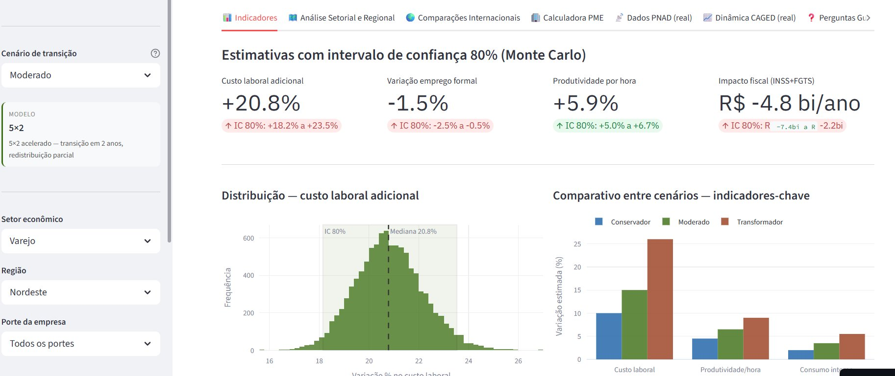
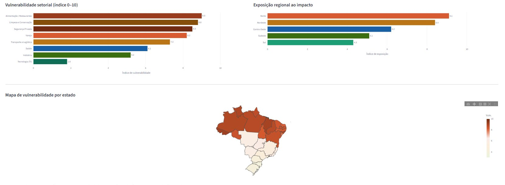
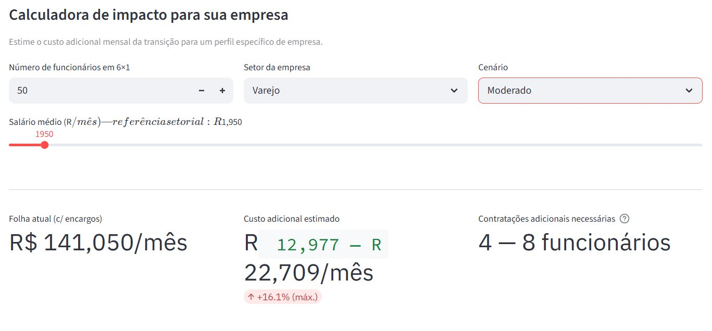

# Brazil Labor Transition Simulator
### Simulador de Impacto da Reforma da Jornada 6×1

> Ferramenta interativa de simulação econômica e análise de cenários para estimar os impactos macroeconômicos, setoriais e regionais de uma eventual transição da escala de trabalho 6×1 para modelos alternativos de organização do tempo de trabalho no Brasil.

[](https://reforma-6x1-simulator.streamlit.app)


**[→ Acessar o app](https://reforma-6x1-simulator.streamlit.app)**

---

## Screenshots

**Indicadores principais — Monte Carlo com IC 80%**


**Vulnerabilidade setorial, exposição regional e mapa por estado**


**Calculadora de impacto para empresas**


---

## O problema

Cerca de **13,5 milhões de trabalhadores formais brasileiros** operam em escala 6×1 — seis dias de trabalho para cada dia de descanso. A proposta de transição para modelos alternativos (5×2 ou 4×3) é um dos debates de política trabalhista mais relevantes do país, mas carece de ferramentas que respondam perguntas concretas:

- Quanto custa a transição para uma PME do varejo no Nordeste?
- Quais setores têm maior risco de migração para a informalidade?
- Em quais regiões a pressão operacional tende a ser mais severa?
- Quanto de ganho de produtividade por hora seria necessário para compensar o aumento de custo?
- Como o Brasil se posiciona frente às experiências internacionais de redução de jornada?

Este simulador foi construído para responder essas perguntas de forma quantitativa, transparente e reproduzível.

---

## Arquitetura analítica

O sistema é estruturado em quatro camadas:

```
┌─────────────────────────────────────────────────────┐
│  Camada 1 — Dados observados                        │
│  PNAD Contínua (IBGE) · Novo CAGED (MTE)            │
│  Informalidade · Horas · Renda · Emprego formal     │
├─────────────────────────────────────────────────────┤
│  Camada 2 — Parâmetros estimados                    │
│  Elasticidades custo-emprego (-0,15 a -0,40)        │
│  Multiplicadores setoriais e regionais calibrados   │
│  Proporção 6×1 por setor (RAIS + pesquisas sindicais│
├─────────────────────────────────────────────────────┤
│  Camada 3 — Motor de cenários probabilísticos       │
│  Monte Carlo (até 50.000 iterações)                 │
│  IC 80% · Distribuições log-normal e normal         │
│  Cenários: Conservador · Moderado · Transformador   │
├─────────────────────────────────────────────────────┤
│  Camada 4 — Outputs de decisão                      │
│  Custo PME · Risco de informalização                │
│  Impacto fiscal (INSS + FGTS) · Pressão regional   │
│  Vulnerabilidade setorial · Comparação internacional│
└─────────────────────────────────────────────────────┘
```

---

## Funcionalidades

| Módulo | Conteúdo |
|---|---|
| **Indicadores** | Métricas principais com IC 80%, histograma Monte Carlo, comparativo entre cenários |
| **Análise Setorial e Regional** | LTVI por setor, mapa choropleth por UF, matriz de impacto setor × porte |
| **Comparações Internacionais** | França / Islândia / Japão / Dinamarca / Alemanha + scatter OCDE horas × produtividade |
| **Calculadora PME** | Custo adicional mensal, contratações necessárias e impacto acumulado por perfil de empresa |
| **Dados PNAD (real)** | Distribuição de horas, informalidade por UF, vulnerabilidade recalibrada com dados observados |
| **Dinâmica CAGED (real)** | Série temporal de saldo de empregos, rotatividade setorial, upload de CSV manual |
| **Perguntas Guiadas** | Framework Q&A com hipóteses declaradas e limitações explícitas do modelo |

---

## Labor Transition Vulnerability Index (LTVI)

Um dos ativos centrais do projeto é o **LTVI** — índice composto que mede a exposição de cada setor ao choque da transição:

```
LTVI = 0,40 × informalidade_real
     + 0,25 × rotatividade_CAGED
     + 0,35 × proporção_6×1_estimada
```

Os pesos foram calibrados com base na literatura empírica sobre sensibilidade do emprego formal a choques de custo trabalhista no Brasil. O índice é recalculado automaticamente quando dados reais da PNAD e CAGED estão disponíveis via API.

| Faixa LTVI | Interpretação |
|---|---|
| 7,5 – 10,0 | Alta vulnerabilidade — risco elevado de informalização e perda de postos formais |
| 5,0 – 7,4 | Vulnerabilidade moderada — absorvível com transição gradual |
| 0,0 – 4,9 | Baixa vulnerabilidade — maior capacidade de absorção do choque |

---

## Cenários de transição

| | Conservador | Moderado | Transformador |
|---|---|---|---|
| **Modelo** | 5×2 | 5×2 | 4×3 |
| **Horizonte** | 4 anos | 2 anos | 3 anos |
| **Custo laboral adicional** | +8% a +12% | +12% a +18% | +20% a +32% |
| **Variação emprego formal** | -1% a +2% | -3% a 0% | -8% a -3% |
| **Produtividade por hora** | +3% a +6% | +5% a +8% | +6% a +12% |
| **Impacto fiscal anual** | R$ -4bi a +2bi | R$ -8bi a 0 | R$ -18bi a -5bi |

*Intervalos = IC 80% do modelo Monte Carlo, sem ajuste de política compensatória.*

---

## Dados e fontes

### Integração via API

| Fonte | Conteúdo | Acesso |
|---|---|---|
| PNAD Contínua (IBGE) | Distribuição de horas, informalidade, renda e ocupados por setor e UF | API SIDRA pública |
| Novo CAGED (MTE) | Série temporal de admissões/demissões por setor e região | API dados abertos MTE |

O sistema implementa **cache local em Parquet** com TTL de 7 dias (PNAD) e 3 dias (CAGED). Quando as APIs estão indisponíveis, o app opera com fallback embutido calibrado nos dados de 2023, sem interrupção do serviço.

### Parâmetros estruturais

- **Elasticidades custo-emprego** (-0,15 a -0,40 por setor): Ramos & Reis (1997), Gonzaga (2003), Corseuil & Foguel (2002)
- **Proporção 6×1 por setor**: estimativa a partir de RAIS 2022 e pesquisas sindicais publicadas
- **Evidências internacionais**: OCDE Labour Statistics, ILO Working Conditions Reports, Crépon & Kramarz (2002), Gudmundsson et al. (2021)

---

## Metodologia

### Motor Monte Carlo

```python
# Pseudocódigo do núcleo do modelo
for each (scenario, sector, region, firm_size):

    # Choque de custo — log-normal (captura assimetria positiva)
    cost_shock ~ LogNormal(μ = mid_range × sector_mult × region_mult,
                           σ = range_width / 4)

    # Variação de emprego — normal
    employment ~ Normal(μ = scenario_mid + size_adj,
                        σ = scenario_range / 4)

    # Produtividade — normal com multiplicador setorial
    productivity ~ Normal(μ = scenario_mid × sector_prod_mult,
                          σ = range_width / 4)

    # IC 80% = percentis [10, 90] sobre n_sim iterações
```

### Hipóteses declaradas

1. Ganhos de produtividade levam **18–36 meses** para se materializar
2. Resposta da informalidade ao custo: **defasagem de 2–4 trimestres**
3. Transição **linear** ao longo do horizonte de cada cenário
4. Encargos patronais: INSS 20% + FGTS 8% + férias 1/12 + 13º 1/12

### Limitações explícitas

- Efeitos de equilíbrio geral entre setores não são modelados
- Choques macroeconômicos exógenos estão fora do escopo
- Desonerações compensatórias de folha alterariam substancialmente os resultados
- Heterogeneidade intra-estadual (capital vs. interior) não é capturada

---

## Instalação local

```bash
git clone https://github.com/thiagolefebure/reforma-6x1-simulator.git
cd reforma-6x1-simulator
pip install -r requirements.txt
streamlit run app.py
```

### Deploy no Streamlit Cloud

1. Push do repositório para o GitHub
2. [share.streamlit.io](https://share.streamlit.io) → New app → selecione o repo
3. Main file path: `app.py` → Deploy

> Antes do primeiro deploy, crie a pasta de cache:
> ```bash
> mkdir -p data/cache && touch data/cache/.gitkeep
> git add data/cache/.gitkeep && git push
> ```

---

## Estrutura do repositório

```
reforma-6x1-simulator/
├── app.py                  ← Interface Streamlit (7 módulos)
├── assets/                 ← Screenshots para o README
├── data/
│   ├── dados.py            ← Parâmetros do modelo, cenários, fallback embutido
│   ├── pnad_api.py         ← Fetcher SIDRA/IBGE com cache Parquet e fallback
│   ├── caged_api.py        ← Fetcher MTE com fallback e suporte a CSV manual
│   ├── pipeline.py         ← Calibração automática de parâmetros com dados reais
│   ├── cache/              ← Cache local (auto-gerado, ignorado pelo git)
│   └── __init__.py
├── requirements.txt
├── .gitignore
└── README.md
```

---

## Roadmap

### v2.0 — atual
- [x] Integração com API SIDRA (PNAD Contínua) e API CAGED (MTE)
- [x] Calibração automática de multiplicadores com dados reais
- [x] Cache local Parquet com TTL e fallback robusto
- [x] Labor Transition Vulnerability Index (LTVI)
- [x] Calculadora PME com curva de impacto acumulado
- [x] Upload de CSV CAGED manual

### v3.0 — planejado
- [ ] **Inferência causal via Diferenças-em-Diferenças** usando acordos coletivos registrados no SACC/MTE como experimento natural
- [ ] Estimador de **Callaway & Sant'Anna (2021)** para tratamentos escalonados no tempo (*staggered DiD*)
- [ ] Validação de **parallel trends** com dados pré-tratamento (CAGED 2018–2022)
- [ ] **Event study** para visualização de efeitos temporais do tratamento
- [ ] Substituição de elasticidades da literatura por **estimativas empíricas próprias**
- [ ] Integração com microdados RAIS para granularidade a nível de estabelecimento

> O v3 tem como objetivo transformar o simulador de uma ferramenta de projeção baseada em parâmetros externos para um instrumento analítico com base empírica própria — estimando efeitos causais reais da adoção de escalas alternativas a partir de variação observada no mercado de trabalho brasileiro.

---

## Citação

```bibtex
@software{reforma6x1_simulator_2024,
  title  = {Brazil Labor Transition Simulator},
  year   = {2024},
  url    = {https://reforma-6x1-simulator.streamlit.app},
  note   = {Ferramenta interativa de simulação econômica para análise
            do impacto da reforma da jornada 6x1 no Brasil.
            Dados: PNAD Contínua (IBGE), Novo CAGED (MTE).}
}
```

---

## Licença

MIT — uso livre para fins analíticos, acadêmicos e de política pública.

---

*Os modelos são simplificações da realidade econômica e não constituem aconselhamento de política pública formal. Os resultados devem ser interpretados como estimativas probabilísticas, não como previsões determinísticas.*
